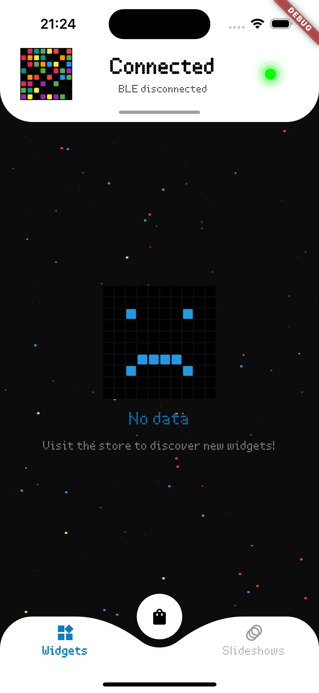
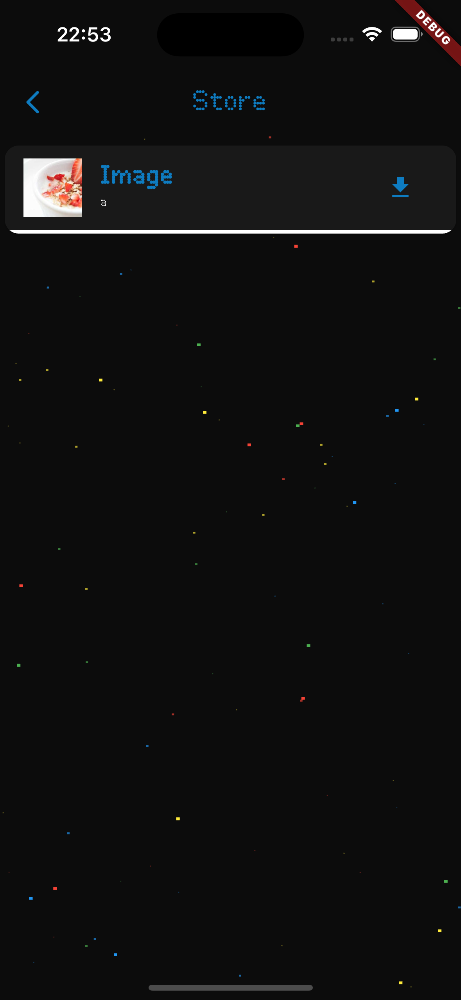
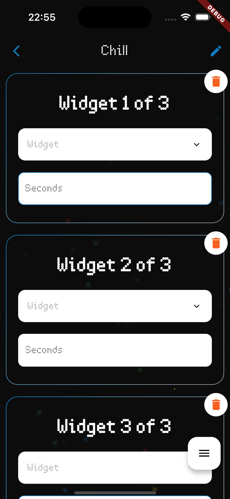
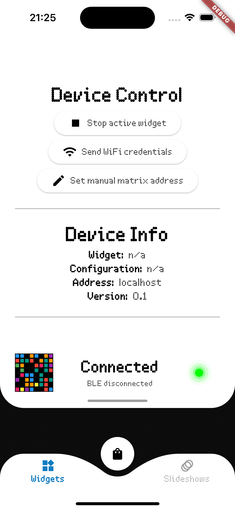

# Mobile App
The mobile app interfaces with the Raspberry Pi to:

- Configure and manage installed widgets.
- Browse and install widgets from the App Store.
- Create and manage slideshows.
- Check device status
- Control device
- Send Wi-Fi credentials via BLE.

    
        
            
    

<!-- <figure markdown>
 {: style="height:83px"}
 {: style="height:83px"}
  <figcaption>Partners</figcaption>
</figure> -->

## Features
- **Custom Widgets**: Develop and display custom Python widgets on a LED matrix.
- **Widget Store**: Submit and download widgets from the online store.
- **Slideshows**: Create slideshows to display multiple widgets in sequence.
- **Network Configuration**: Easily configure network settings via BLE or COAP.
- **Local IP Retrieval**: Use BLE to get the local IP address of the Raspberry Pi for COAP connections.

## Developing Widgets
Developers can create widgets using Python and submit them to the App Store. Each widget can be either static or configurable. For example:
- **Static Widget**: Displays fixed information such as the current time.
- **Configurable Widget**: Requires user input, such as a grocery list widget.

## Mobile App Functionality
The mobile app offers various features to enhance your Mosaico experience:
- **App Store Access**: Browse and install widgets from the store.
- **Widget Management**: Add, remove, and configure widgets.
- **Slideshow Creation**: Combine multiple widgets into a slideshow with specified durations.

## Creating Slideshows
Slideshows allow you to display a sequence of widgets on your LED matrix. Each slideshow is composed of multiple slideshow items, defined as:
- **widget_id**: The identifier of the widget.
- **config_id** (if any): The identifier of the widget configuration.
- **durationSeconds**: The duration for which the widget is displayed.

## Connecting to Wi-Fi
The mobile app can send Wi-Fi credentials to the Raspberry Pi via BLE, enabling easy network configuration. When the matrix is connected to the internet, BLE can also be used to retrieve the local IP address for COAP communication.

