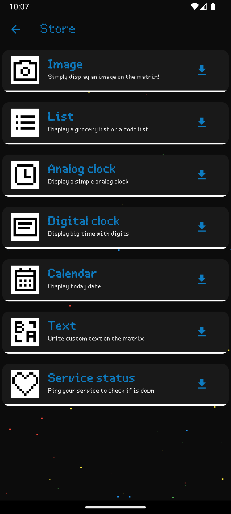
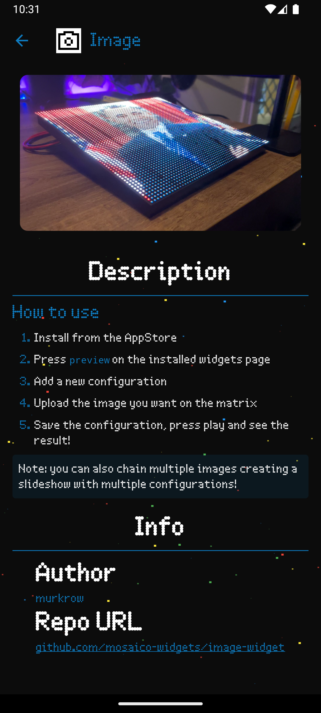
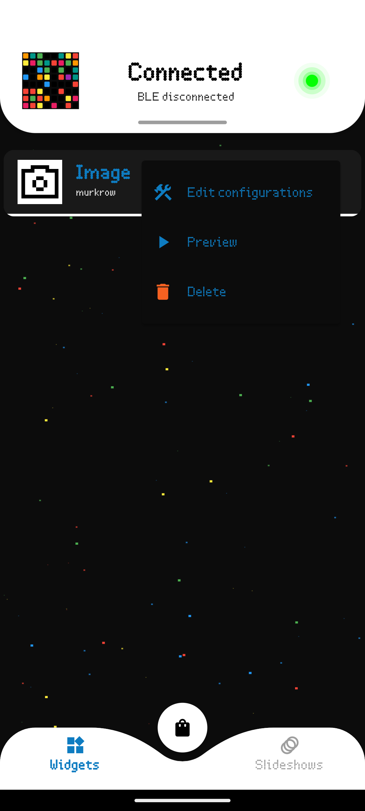
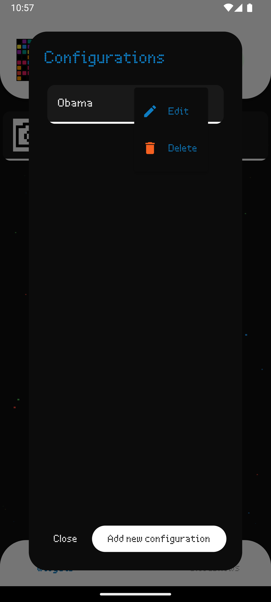
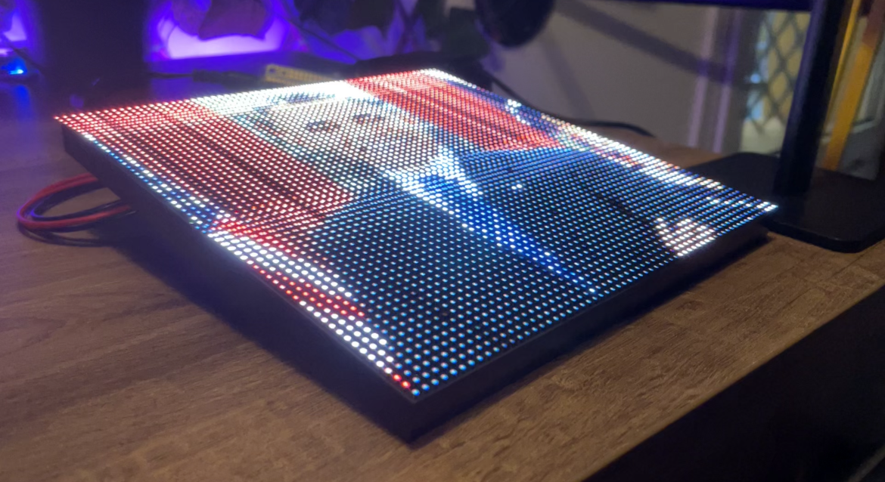

# Mobile App
The mobile app interfaces with the Raspberry Pi to:

- Browse and install widgets from the **app store**.
- Configure and manage **installed widgets**.
- Create and manage **slideshows**.
- Check **device status**
- **Control device**

## App Store
The store is the place to find and fall in love with new widgets.
Developers can submit their widgets, upload a custom icon, provide a tagline and a rich markdown description.
The widget itself is hosted on a **git repo** so that it can be updated and maintained by the developer and easy to retrieve by the Raspberry Pi.

    
    

Once clicked on a widget, the user can see the widget details, by clicking on the install button,
the Raspberry Pi will proceed to git clone the widget and configure it for us.

Once the widget has been installed it will be ready in the widgets tab.

## Installed widgets
This is the first screen displayed when the app is launched.
From here, the user can see, configure and manage the widgets installed on the Raspberry Pi.

    
    
    

We can define 3 types of widgets:

- **Static**: Widgets that don't require any configurations
    - A clock
    - An inspirational quote
    - News headlines
    - Stock prices
- **Configurable**: Widgets that require some input from the user before being displayed
    - Weather forecast
    - Todo list
    - Image to pixel art
- **Interactive**: Widgets that require live interaction with the user (coming soon)
    - Games
    - Painter