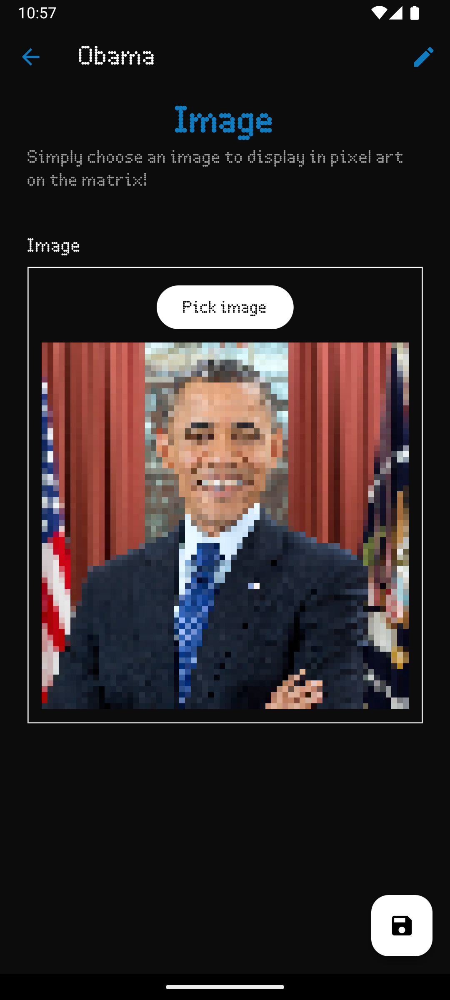

# Mosaico
Mosaico is a unique (free and open source ❤️) platform that allows **users** and **developers** to create, share, and display custom widgets on a **LED matrix**. This ecosystem is composed of various applications working together to bring vibrant, customizable content to your Raspberry Pi-driven LED matrix.

    
    
    

## Introduction
Mosaico is designed to empower both users and developers by providing an open platform where custom Python widgets can be created and displayed on a LED matrix. Whether you want to show the time, weather, or your latest grocery list, Mosaico makes it easy to develop and deploy your ideas.

## Some examples of widgets:
- Display the current time and date.
- Show the weather forecast for your location.
- Create a shopping list widget.
- Upload a custom image and display it as pixel art.
- Write custom text messages or quotes.
- Create animations or visual effects.
- Anything else you can imagine!

## Architecture Overview

The Mosaico Ecosystem consists of:

- **Raspberry Pi Software**: Written in C++ and Python, this software drives the LED matrix and manages the execution of widgets.
- **Mobile App**: Developed with Flutter, connects to the Raspberry Pi via BLE and COAP, allowing users to manage widgets, browse the App Store, create slideshows, and configure network settings.
- **App Store**: Developed with Laravel, a web platform where developers can submit their widgets for others to use.
- **IDE**: A (dummy) desktop application that allows developers to create and test widgets locally. It is meant to be a lightweight tool to help developers get started with widget development.
- **Simulator**: An X11 window that simulates the LED matrix for development purposes. A web-based simulator is in the works and will allow developers to test their widgets without a physical matrix in the easiest way possible.

[//]: # (## Support)

[//]: # (For more information and support, visit our [documentation]&#40;#&#41; or contact our [support team]&#40;#&#41;.)

[//]: # ()
[//]: # (![Support]&#40;https://via.placeholder.com/300x200&#41;)

[//]: # ()
[//]: # (Join the Mosaico community and start creating your own vibrant LED matrix displays today!)

[//]: # (## Donations)