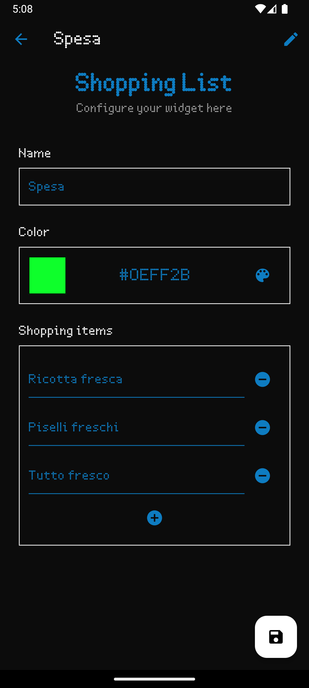

# Configuration generator
One of the most interesting features of the shared library is the configuration generator.

This module can parse arbitrary .json files (also .yml in future) and convert them into a flutter form, which can be used to request data from the user to create a widget configuration.
This choice was crucial to allow developers to create new widgets without having to worry about the UI, and to have consistency in the configuration of widgets from different developers.

## Examples


A simple example of a configuration file to create a configurations to upload an image to the matrix could be:
/// html | div[style='float: left; width: 60%;']
```json
{
  "form": {
    "title": "Image",
    "description": "Simply choose an image to display in pixel art on the matrix!",
    "fields": [
      {
        "image": {
          "type": "image",
          "label": "Image",
          "required": true       
          }
      }
    ]
  }
}
```
///

/// html | div[style='float: right;width: 40%;']

///

/// html | div[style='clear: both;']
///

A simple example of a configuration file for a shopping list widget could be:
/// html | div[style='float: left; width: 59%;']
```json
{
  "form": {
    "title": "Shopping List",
    "description": "Configure your widget here",
    "fields": [
      {
        "name": {
          "type": "string",
          "label": "Name",
          "required": true,
          "placeholder": "Enter the name of this list"
        },
         "color": {
          "type": "color",
          "label": "Color",
          "required": true,
          "placeholder": "Choose the color of the title"
        },
        "items": {
          "type": "string[]",
          "label": "Shopping items",
          "required": true,
          "placeholder": "Insert your items here"
        }
      }
    ]
  }
}
        
```
///

/// html | div[style='float: right;width: 40%;']

///

/// html | div[style='clear: both;']
///


## Result of the configuration
The data collected from the user is then saved in a .json file, which is then parsed by C++ when a specific widget with that configuration is loaded.
Getting data from the configuration is very easy and can be done in python with the following code:
```python
from mosaico import widget, config # config is the object holding all data from the configuration

text = widget.createText()
text.setText(config["name"]) # Get the name of the list from the configuration
text.setHexColor(config["color"]) # Get the color of the heading from the configuration
text.translate(2,2)
text.setFontHeight(10)

# Create items
items = []
for i in range(0, len(config["items"])): # We can iterate in the array provided by the user
    items.append(widget.createText())
    items[i].setFontHeight(6)
    items[i].setText(config["items"][i])
    items[i].translate(2, 6+ 7 * (i + 1))

def loop():
    pass
```

### What about the assets?
User uploaded assets like images are saved in the .tar.gz archive in the assets folder, a helper function is available to retrieve the path of the asset in the archive.
```python
from mosaico import widget, config

# Create image
img = widget.createImage(widget.configAsset("image")) # The name of the asset

def loop():
    pass
```

## Implementation

### Flutter
The configuration generator (and its flutter component, `dynamic_form`) are made up with extensibility in mind, so that's easy to add new field types.
The `dynamic_form_state_builder` is responsible to parse the config-form.json file and create the form state. The implementation is easy and uses inheritance
to easily manage the similarities between the different field types.
```dart
class DynamicFormStateBuilder {

  /// The form that is being built
  DynamicFormState _formModel = DynamicFormState();


  /// Adds the common attributes to a generic mosaico component
  void _addComponentAttributes(MosaicoField component,
      Map<String, dynamic> attributes, String fieldName) {
    component.getState().setName(fieldName);
    component.getState().setLabel(attributes['label'] ?? fieldName);
    component.getState().setPlaceholder(attributes['placeholder'] ?? '');
    component.getState().setRequired(attributes['required']);
    component.getState().setOldConfigPath(_formModel.getOldConfigDirPath());
  }

  DynamicFormStateBuilder(Map<String, dynamic> configForm) {

    // Get the main form
    var form = configForm['form'];

    // Set title and description
    _formModel.setTitle(form['title']);
    _formModel.setDescription(form['description']);

    // Get fields
    var fields = form['fields'];

    // Cycle through all fields
    for (var field in fields) {
      // Get field key (name of the field)
      for (var fieldName in field.keys) {
        // Retrieve field attributes
        var attributes = field[fieldName];

        // Add the final field to the form based on its type
        MosaicoField mosaicoField;
        switch (attributes['type']) {
          case 'string':
            mosaicoField = MosaicoStringField();
            break;
          case 'string[]':
            mosaicoField = MosaicoStringListField();
            break;
          case 'image':
            mosaicoField = MosaicoImageField();
            break;
          case 'color':
            mosaicoField = MosaicoColorField();
            break;
          case 'checkbox':
            throw Exception('Checkbox field not implemented yet');
            break;
          case 'animation':
            throw Exception('Animation field not implemented yet');
            break;
          default:
            throw Exception('Unknown field type: ${attributes['type']}');
        }

        // Add common attributes
        _addComponentAttributes(mosaicoField, attributes, fieldName);

        // Add the field to the form
        _formModel.addField(mosaicoField);
      }
    }
  }


  DynamicFormState buildFormModel() {
    return _formModel;
  }

}

```

Getting values from the fields is easy too, all the fields use a common state class that needs to implement the `MosaicoFieldState` interface.
```dart
abstract class MosaicoFieldState extends ChangeNotifier {

  /*
  * Name
  */
  late String _name = "";
  void setName(String name) {
    _name = name;
  }
  String getName() {
    return _name;
  }

  /*
  * Label
  */
  late String _label;
  void setLabel(String label) {
    _label = label;
  }
  String getLabel() {
    return _label;
  }

  /*
  * Placeholder
  */
  String? _placeholder;
  void setPlaceholder(String placeholder) {
    _placeholder = placeholder;
  }
  String? getPlaceholder() {
    return _placeholder;
  }

  /*
  * Required
  */
  bool _required = false;
  void setRequired(bool required) {
    _required = required;
  }
  bool isRequired() {
    return _required;
  }

  /*
  * Edit mode
  */
  String? _oldConfigPath;
  bool get isEditMode => _oldConfigPath != null && _oldConfigPath!.isNotEmpty;
  void setOldConfigPath(String oldConfigPath) {
    _oldConfigPath = oldConfigPath;
  }
  String? getOldConfigPath() {
    return _oldConfigPath;
  }

  /*
  * Stuff to override
  */

  /// Called when form is submitted
  /// Return null if valid, error message if not
  String? validate();

  /// This method should return the field data to be available in the config json
  dynamic getData();

  /// Optional override to save an asset into the config
  dynamic getAsset();

  /// Provides the field with the old value previously saved with getData
  void init(dynamic oldValue);
}
```

This ensures that in a later stage, when the form is submitted, we can easily get the data from the fields and save it in a .json file.
This is done by the `config_form_state` file that manages the form state and the form submission, and the `config_output` file that manages the final output of the form.
```dart
/*
* Final output
*/
  String buildConfigJson() {
    Map<String, dynamic> editJson = {};
    for (var field in _fields) {
      var fieldData = field.getState().getData();
      if (fieldData == null) continue;
      editJson[field.getState().getName()] = field.getState().getData();
    }
    return jsonEncode(editJson);
  }

  // Export the form to a ConfigOutput object
  Future<ConfigOutput> export() async {
    var output = ConfigOutput();
    await output.initialize();

    // Config name
    output.setConfigName(_configName);

    // Config json
    output.saveConfigJson(buildConfigJson());

    // Assets
    for (var field in _fields) {
      if (field.getState().getAsset() != null) {
        output.saveAsset(
            field.getState().getName(), field.getState().getAsset()!);
      }
    }

    return output;
  }
```


### Files
At the end of the day, a configuration is just a .tar.gz archive, created locally on the device with the [archive](https://pub.dev/packages/archive) package.
The `config_output` class is responsible for creating the archive and saving the json file.
```dart
class ConfigOutput {

  var logger = Logger(
    printer: PrettyPrinter(),
  );

  late final String _tempPath;
  late final String _dataOutputPath;
  late final String _configName;

  /// Initialize the _tempPath
  /// CALL THIS BEFORE SETTING ANYTHING!
  Future<void> initialize() async {

    // Create temp path
    Directory tempDir = await getTemporaryDirectory();
    _tempPath = tempDir.path + "/config_output";
    _dataOutputPath = _tempPath + "/data";

    // Create new directories
    Directory(_tempPath).createSync();
    Directory(_dataOutputPath).createSync();
  }

  /**
   * Configuration name
   */
  void setConfigName(String name) {
    _configName = name;
  }
  String getConfigName() {
    return _configName;
  }

  /**
   * Save files to disk in temp folder as they are provided
   */
  void saveConfigJson(String json) {
    File('$_dataOutputPath/config.json').writeAsStringSync(json);
  }

  void saveAsset(String assetName, String assetContent) {
    // Create assets directory if it doesn't exist
    Directory('$_dataOutputPath/assets').createSync();
    File('$_dataOutputPath/assets/$assetName').writeAsStringSync(assetContent);
  }

  /**
   * Export everything
   */

  /// Exports the created directory with config files to a .tar.gz archive
  /// Returns the path to the archive
  String exportToArchive() {

    // Define the source directory and the output file
    final sourceDir = Directory(_dataOutputPath);
    final outputFile = File('$_tempPath/config.tar.gz');

    // Create an archive
    final encoder = TarFileEncoder();
    encoder.open('$_tempPath/config.tar');

    // Add the contents of the directory to the archive
    encoder.addDirectory(sourceDir, includeDirName: false);

    // Close the archive to finalize the tar file
    encoder.close();

    // Read the tar file
    final tarFile = File('$_tempPath/config.tar');
    final tarBytes = tarFile.readAsBytesSync();

    // Compress the tar file using gzip
    final gzBytes = GZipEncoder().encode(tarBytes);

    // Write the compressed file to disk
    outputFile.writeAsBytesSync(gzBytes!);

    // Optionally delete the intermediate tar file
    tarFile.deleteSync();

    logger.d('Exported config to: ${outputFile.path}');
    return outputFile.path;
  }


}
```