# Showcase
The mobile app interfaces with the Raspberry Pi to:

- Browse and install widgets from the **app store**.
- Configure and manage **installed widgets**.
- Create and manage **slideshows**.
- Check **device status**
- **Control device**

## App Store
The store is the place to find and fall in love with new widgets.
Developers can submit their widgets, upload a custom icon, provide a tagline and a rich markdown description.
The widget itself is hosted on a **git repo** so that it can be updated and maintained by the developer and easy to retrieve by the Raspberry Pi.

    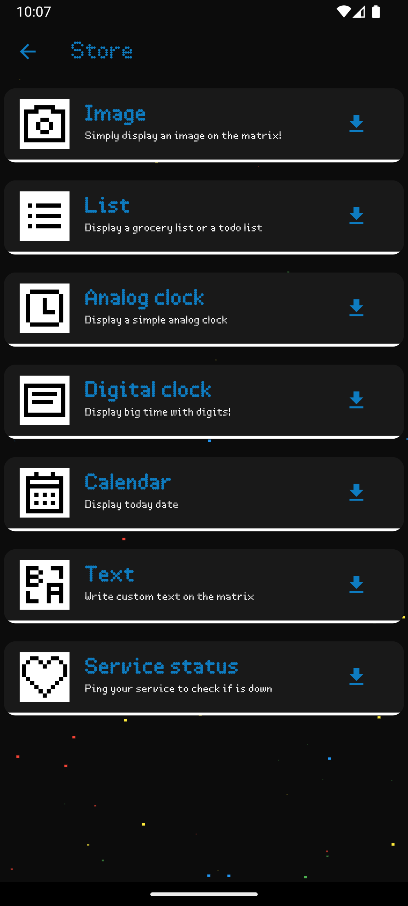
    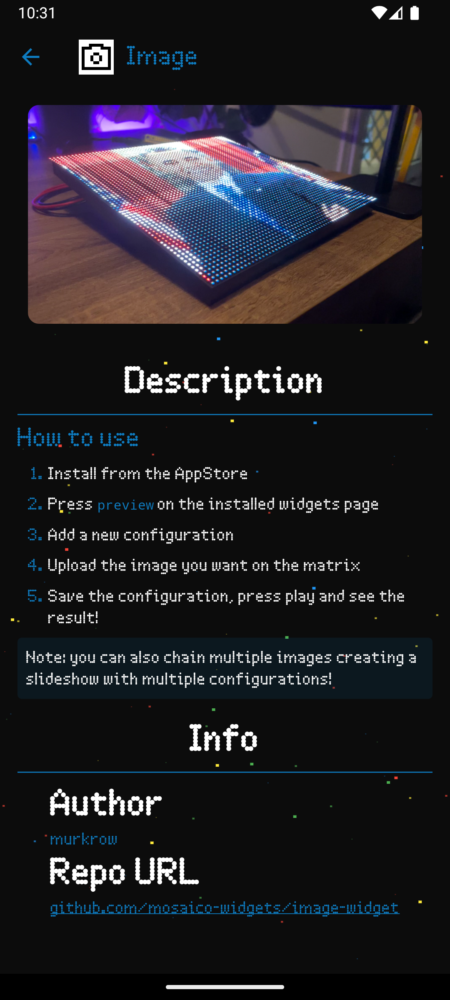

Once clicked on a widget, the user can see the widget details, by clicking on the install button,
the Raspberry Pi will proceed to git clone the widget and configure it for us.

Once the widget has been installed it will be ready in the widgets tab.

## Installed widgets
This is the first screen displayed when the app is launched.
From here, the user can see, configure and manage the widgets installed on the Raspberry Pi.

    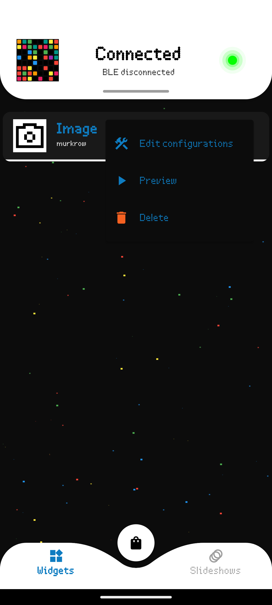
    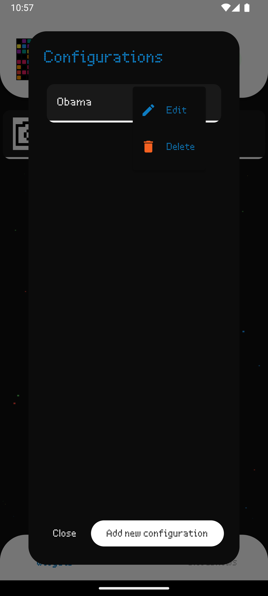
    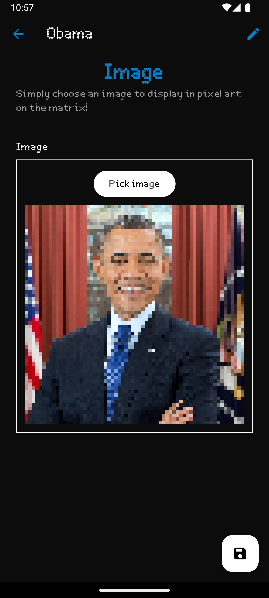

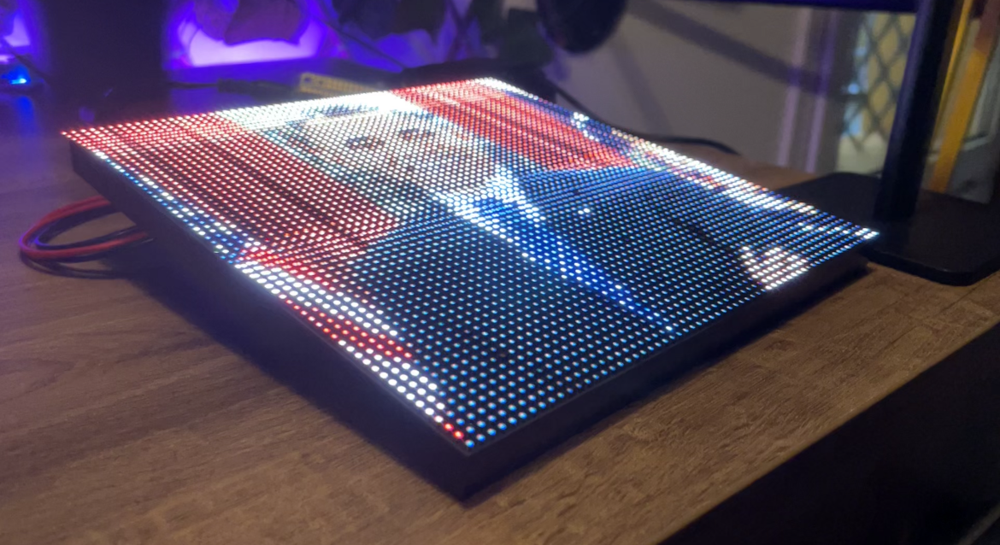

We can define 3 types of widgets:

- **Static**: Widgets that don't require any configurations
    - A clock
    - An inspirational quote
    - News headlines
    - Stock prices
- **Configurable**: Widgets that require some input from the user before being displayed
      - Weather forecast
      - Todo list
      - Image to pixel art
- **Interactive**: Widgets that require live interaction with the user (coming soon)
      - Games
      - Painter

## Slideshows
The slideshow feature allows the user to create a sequence of widgets that will be displayed in a loop.
The user can define the duration of each widget in seconds.

    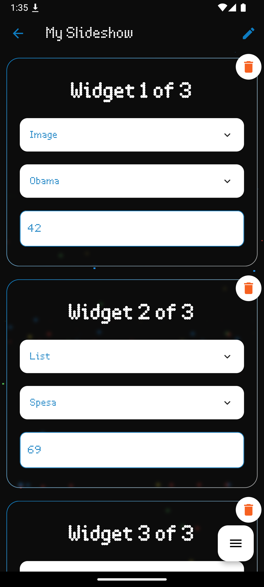
    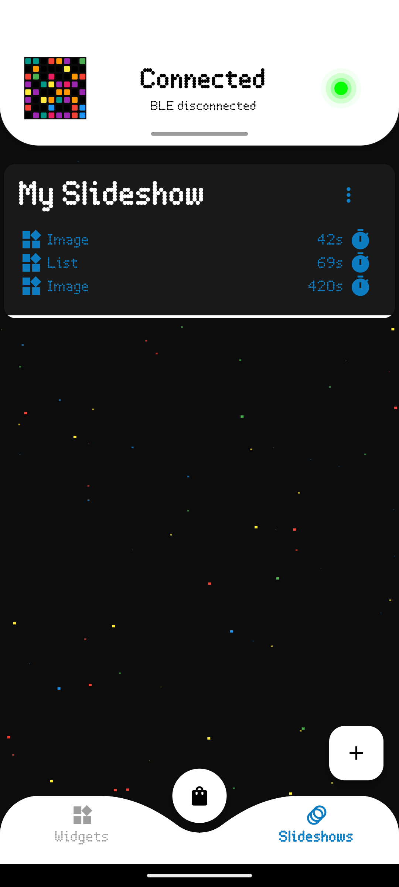

## Device status
When in the home screen, the status of the connection to the Raspberry Pi is always displayed. In particular we consider the app `connected`
to the device when a COAP connection can be established, a warning will be displayed if BLE is not connected.

All the major features of the app are available only when the app is connected to the Raspberry Pi via COAP while BLE is only 
used to find the matrix on the local network (discovery) or to send network credentials in case the matrix is not connected to the network yet.

By pulling down the sliding panel we can obtain more information about the device, such as the IP address, the firmware version, and the current widget/configuration being displayed.

    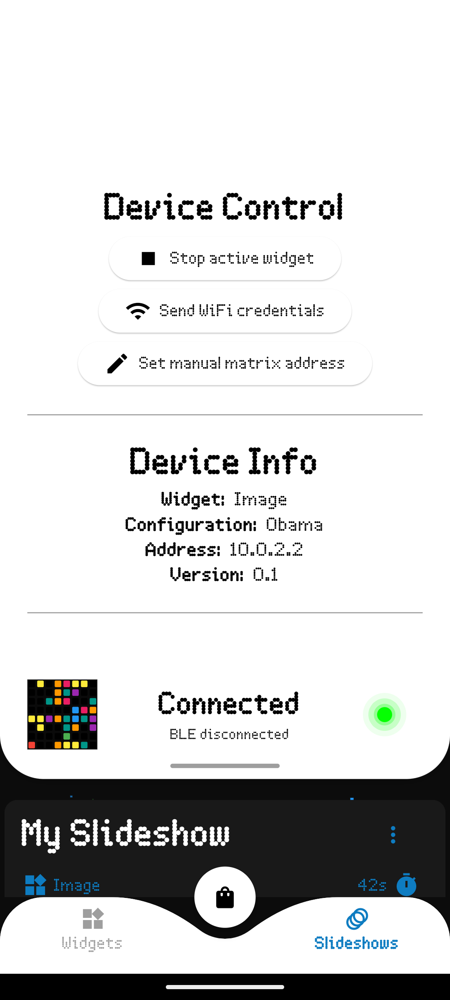
    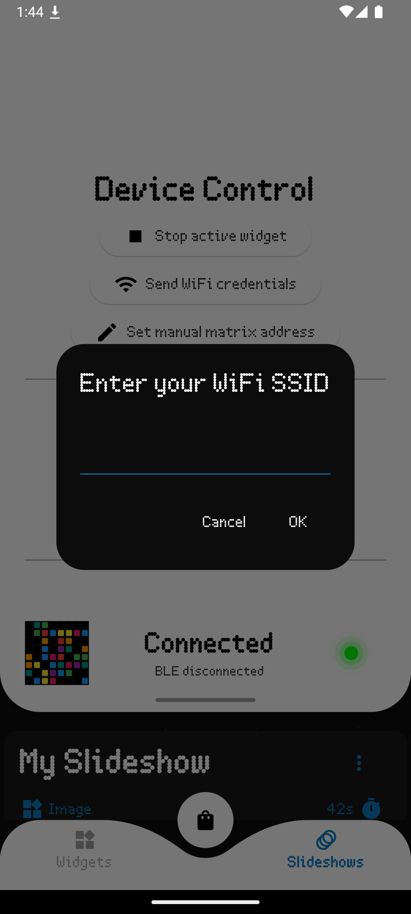
    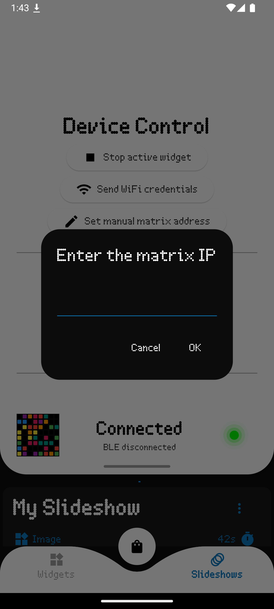

